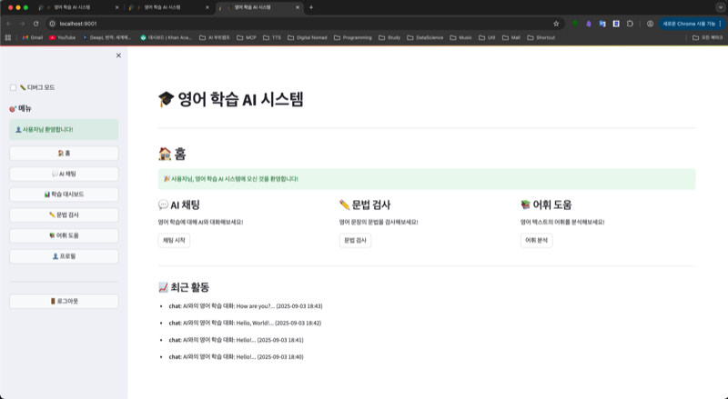
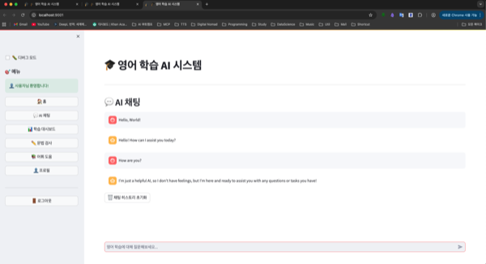
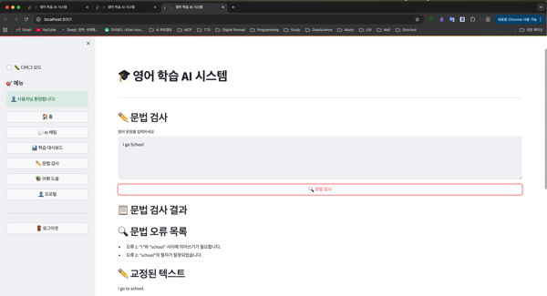
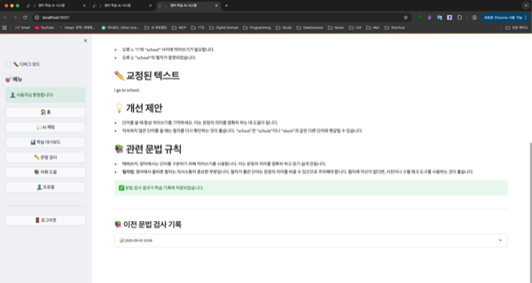
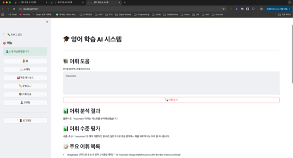
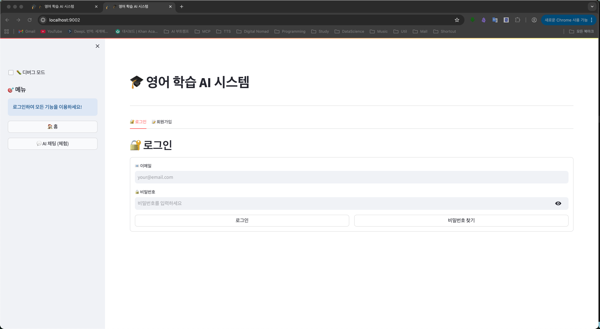
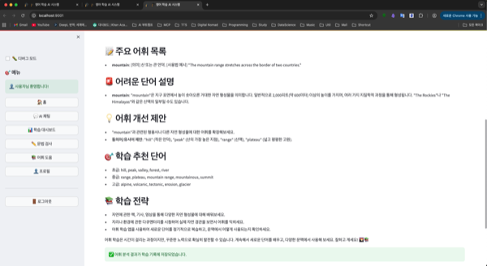

# 🎓 WordQuest Claude Integration - 영어 학습 AI 시스템

<div align="center">


**AI 기반 영어 학습 시스템으로 OpenAI와 Solar API를 활용한 지능형 영어 교육 플랫폼**

[🚀 빠른 시작](#-빠른-시작) • [📖 기능 소개](#-주요-기능) • [🛠️ 설치 가이드](#-설치-가이드) • [📚 사용법](#-사용법) • [🔧 개발 가이드](#-개발-가이드)

</div>

---

## 📋 목차

- [🎯 프로젝트 개요](#-프로젝트-개요)
- [✨ 주요 기능](#-주요-기능)
- [🚀 빠른 시작](#-빠른-시작)
- [🛠️ 설치 가이드](#-설치-가이드)
- [📚 사용법](#-사용법)
- [🔧 개발 가이드](#-개발-가이드)
- [📁 프로젝트 구조](#-프로젝트-구조)
- [🔑 환경 변수 설정](#-환경-변수-설정)
- [🐛 문제 해결](#-문제-해결)
- [📝 기여하기](#-기여하기)
- [📄 라이선스](#-라이선스)

---

## 🎯 프로젝트 개요

**WordQuest Claude Integration**은 AI 기술을 활용한 혁신적인 영어 학습 시스템입니다. OpenAI와 Solar API를 통해 자연스러운 영어 대화, 문법 검사, 어휘 학습을 제공하며, 사용자의 학습 진도를 체계적으로 관리합니다.

### 🌟 핵심 특징

- **🤖 AI 기반 학습**: OpenAI GPT와 Solar AI를 활용한 지능형 영어 교육
- **💬 자연스러운 대화**: 실제 영어 원어민과 대화하는 것과 같은 경험
- **📊 학습 진도 추적**: 개인별 학습 데이터 분석 및 통계 제공
- **🌐 웹 기반 인터페이스**: Streamlit을 활용한 직관적이고 반응형 UI
- **🔒 보안 강화**: JWT 기반 인증 및 비밀번호 암호화

---

## ✨ 주요 기능

### 🎨 사용자 인터페이스

#### 🏠 홈 페이지
- **웰컴 메시지**: 개인화된 환영 화면
- **퀵 스타트 카드**: 주요 기능으로의 빠른 접근
- **최근 활동**: 사용자의 학습 활동 요약

{width=600px}

#### 💬 AI 채팅
- **실시간 대화**: AI와 자연스러운 영어 대화
- **맥락 이해**: 이전 대화 내용을 고려한 응답
- **학습 기록**: 모든 대화 내용을 데이터베이스에 저장
- **히스토리 관리**: 채팅 기록 초기화 및 관리

{width=600px}

#### 📊 학습 대시보드
- **학습 통계**: 전체 학습 시간, 대화 수, 문법 검사 수 등
- **주간 활동 차트**: 시각적 학습 진도 표시
- **최근 기록**: 최근 학습 활동 목록

{width=600px}

#### ✏️ 문법 검사
- **영어 문장 분석**: 입력된 영어 문장의 문법 검토
- **오류 수정 제안**: 구체적인 수정 방법 제시
- **학습 기록**: 검사한 문장들을 데이터베이스에 저장

{width=600px}

#### 📚 어휘 도움
- **단어/표현 분석**: 영어 단어나 표현의 상세 설명
- **예문 제공**: 실제 사용 예시와 문맥 설명
- **학습 추적**: 검색한 어휘들의 학습 기록

{width=600px}

#### 👤 프로필 관리
- **개인 정보**: 사용자명, 이메일, 실명 관리
- **비밀번호 변경**: 보안을 위한 비밀번호 업데이트
- **계정 삭제**: 사용자 계정 완전 제거
- **학습 통계 요약**: 개인 학습 성과 요약

{width=600px}

### 🔐 인증 시스템

#### 📝 회원가입
- **사용자 정보 입력**: 사용자명, 이메일, 실명, 비밀번호
- **비밀번호 강도 검증**: 보안을 위한 강력한 비밀번호 요구사항
- **중복 확인**: 사용자명과 이메일 중복 검사

{width=600px}

#### 🔑 로그인
- **이메일/비밀번호 인증**: 안전한 로그인 시스템
- **JWT 토큰**: 보안을 위한 JSON Web Token 사용
- **세션 관리**: 로그인 상태 유지 및 관리

{width=600px}

---

## 🚀 빠른 시작

### 📋 사전 요구사항

- **Python 3.11+** 설치
- **PostgreSQL** 데이터베이스
- **Git** 클라이언트
- **API 키**: OpenAI, Solar API

### ⚡ 5분 만에 시작하기

```bash
# 1. 프로젝트 클론
git clone https://github.com/ProDevJune/wordquest-claude-integration.git
cd wordquest-claude-integration

# 2. 가상환경 생성 및 활성화
python3.11 -m venv venv_py311
source venv_py311/bin/activate

# 3. 의존성 설치
pip install -r requirements.txt

# 4. 환경 변수 설정
cp env.example .env
# .env 파일에 API 키 입력

# 5. 데이터베이스 테이블 생성
python -c "from app.core.database import db; db.create_tables_if_not_exist()"

# 6. 앱 실행
streamlit run main.py --server.port 9001 --server.address localhost
```

**🌐 브라우저에서 http://localhost:9001 접속**

---

## 🛠️ 설치 가이드

### 📥 1단계: 프로젝트 다운로드

```bash
# GitHub에서 프로젝트 클론
git clone https://github.com/ProDevJune/wordquest-claude-integration.git

# 프로젝트 폴더로 이동
cd wordquest-claude-integration

# 현재 브랜치 확인
git branch
```

### 🐍 2단계: Python 환경 설정

#### Python 3.11 설치 (권장)

**macOS (Homebrew 사용):**
```bash
brew install python@3.11
python3.11 --version
```

**Ubuntu/Debian:**
```bash
sudo apt update
sudo apt install python3.11 python3.11-venv python3.11-pip
python3.11 --version
```

**Windows:**
- [Python 3.11 공식 사이트](https://www.python.org/downloads/)에서 다운로드
- 설치 시 "Add Python to PATH" 체크

#### 가상환경 생성

```bash
# 가상환경 생성
python3.11 -m venv venv_py311

# 가상환경 활성화
# macOS/Linux
source venv_py311/bin/activate

# Windows
venv_py311\Scripts\activate

# 활성화 확인
which python  # macOS/Linux
where python  # Windows
```

### 📦 3단계: 의존성 설치

```bash
# pip 업그레이드
pip install --upgrade pip

# 프로젝트 의존성 설치
pip install -r requirements.txt

# 설치 확인
pip list
```

### 🗄️ 4단계: 데이터베이스 설정

#### PostgreSQL 설치

**macOS:**
```bash
brew install postgresql@14
brew services start postgresql@14
```

**Ubuntu/Debian:**
```bash
sudo apt install postgresql postgresql-contrib
sudo systemctl start postgresql
sudo systemctl enable postgresql
```

**Windows:**
- [PostgreSQL 공식 사이트](https://www.postgresql.org/download/windows/)에서 다운로드
- 설치 시 비밀번호 설정 기억

#### 데이터베이스 생성

```bash
# PostgreSQL 접속
psql postgres

# 데이터베이스 생성
CREATE DATABASE wordquest;

# 사용자 생성 (선택사항)
CREATE USER jayden WITH PASSWORD 'your_password';

# 권한 부여
GRANT ALL PRIVILEGES ON DATABASE wordquest TO jayden;

# PostgreSQL 종료
\q
```

### ⚙️ 5단계: 환경 변수 설정

```bash
# 환경 변수 예시 파일 복사
cp env.example .env

# .env 파일 편집
nano .env  # 또는 code .env
```

**필수 환경 변수:**
```bash
# OpenAI API 설정
OPENAI_API_KEY=your_openai_api_key_here

# Solar API 설정 (Upstage)
SOLAR_API_KEY=your_solar_api_key_here

# 데이터베이스 설정
DATABASE_URL=postgresql://jayden@localhost:5432/wordquest
DATABASE_HOST=localhost
DATABASE_PORT=5432
DATABASE_NAME=wordquest
DATABASE_USER=jayden
DATABASE_PASSWORD=your_password

# JWT 및 보안 설정
JWT_SECRET_KEY=your_jwt_secret_key_here_change_in_production
SECRET_KEY=your_secret_key_here_change_in_production

# 웹서버 설정
HOST=localhost
PORT=9001
```

### 🚀 6단계: 앱 실행

```bash
# 데이터베이스 테이블 생성
python -c "from app.core.database import db; db.create_tables_if_not_exist()"

# Streamlit 앱 실행
streamlit run main.py --server.port 9001 --server.address localhost
```

**✅ 성공! 브라우저에서 http://localhost:9001 접속**

---

## 📚 사용법

### 🆕 첫 사용자 가이드

#### 1. 회원가입
1. **회원가입 탭** 클릭
2. **사용자 정보 입력**:
   - 사용자명: 원하는 사용자명
   - 이메일: 실제 이메일 주소
   - 실명: 본명 또는 닉네임
   - 비밀번호: `Password123!` (특수문자 포함)
   - 비밀번호 확인: 동일하게 입력
3. **회원가입 버튼** 클릭

#### 2. 로그인
1. **로그인 탭** 클릭
2. **이메일과 비밀번호** 입력
3. **로그인 버튼** 클릭

### 💬 AI 채팅 사용법

#### 기본 대화
1. **AI 채팅 탭** 클릭
2. **메시지 입력창**에 영어 질문 입력
3. **전송 버튼** 클릭 또는 Enter 키
4. **AI 응답** 확인

#### 대화 예시
```
사용자: "Hello, how are you?"
AI: "Hello! I'm doing well, thank you for asking. How can I help you with your English learning today?"

사용자: "Can you help me practice English conversation?"
AI: "Of course! I'd be happy to help you practice English conversation. What would you like to talk about?"
```

#### 채팅 히스토리 관리
- **채팅 히스토리 초기화**: 🗑️ 버튼 클릭
- **자동 저장**: 모든 대화는 자동으로 데이터베이스에 저장
- **학습 진도 추적**: 대화 내용을 바탕으로 학습 통계 생성

### ✏️ 문법 검사 사용법

#### 문장 검사
1. **문법 검사 탭** 클릭
2. **영어 문장 입력**:
   ```
   "I goes to school every day."
   ```
3. **검사 버튼** 클릭
4. **결과 확인**:
   ```
   ❌ 오류: "I goes" → "I go"
   💡 설명: 1인칭 단수 주어 뒤에는 동사 원형 사용
   ✅ 수정된 문장: "I go to school every day."
   ```

#### 검사 결과 활용
- **오류 패턴 학습**: 자주 틀리는 문법 패턴 파악
- **수정 방법 기억**: 올바른 문법 규칙 학습
- **학습 기록**: 검사한 문장들을 데이터베이스에 저장

### 📚 어휘 도움 사용법

#### 단어/표현 검색
1. **어휘 도움 탭** 클릭
2. **검색어 입력**:
   ```
   "break the ice"
   ```
3. **검색 버튼** 클릭
4. **결과 확인**:
   ```
   🔍 "break the ice"
   📖 의미: 대화를 시작하다, 분위기를 부드럽게 하다
   💡 예문: "Let me break the ice by introducing myself."
   🎯 사용법: 새로운 사람들과 만날 때 사용하는 표현
   ```

#### 어휘 학습 팁
- **문맥 이해**: 예문을 통해 실제 사용 상황 파악
- **관련 표현**: 유사한 의미의 다른 표현들도 함께 학습
- **학습 기록**: 검색한 어휘들을 데이터베이스에 저장

### 📊 학습 대시보드 활용

#### 통계 확인
- **전체 학습 시간**: 누적 학습 시간 확인
- **대화 수**: AI와 나눈 총 대화 수
- **문법 검사 수**: 검사한 문장 수
- **어휘 검색 수**: 검색한 단어/표현 수

#### 주간 활동 분석
- **활동 차트**: 일별 학습 활동 시각화
- **학습 패턴**: 언제 가장 많이 학습하는지 파악
- **목표 설정**: 주간 학습 목표 설정 및 달성도 확인

### 👤 프로필 관리

#### 개인 정보 수정
1. **프로필 탭** 클릭
2. **수정할 정보** 변경
3. **저장 버튼** 클릭

#### 비밀번호 변경
1. **비밀번호 변경** 섹션에서
2. **현재 비밀번호** 입력
3. **새 비밀번호** 입력 (특수문자 포함)
4. **비밀번호 확인** 입력
5. **변경 버튼** 클릭

#### 계정 삭제
1. **계정 삭제** 섹션에서
2. **삭제 확인** 입력
3. **삭제 버튼** 클릭
4. **⚠️ 주의**: 이 작업은 되돌릴 수 없음

---

## 🔧 개발 가이드

### 🏗️ 아키텍처 개요

```
wordquest-claude-integration/
├── app/                          # 핵심 애플리케이션
│   ├── core/                     # 핵심 모듈
│   │   ├── config.py            # 설정 관리
│   │   ├── database.py          # 데이터베이스 연결
│   │   └── security.py          # 보안 및 인증
│   ├── services/                 # 비즈니스 로직
│   │   ├── auth_service.py      # 사용자 인증
│   │   ├── ai_service.py        # AI API 연동
│   │   └── learning_service.py  # 학습 데이터 관리
│   └── __init__.py
├── docs/                         # 문서
├── main.py                       # Streamlit 메인 앱
├── requirements.txt              # Python 의존성
└── .env                          # 환경 변수
```

### 🔌 API 연동

#### OpenAI API
- **모델**: GPT-4 (기본값)
- **용도**: 영어 학습, 문법 검사, 어휘 설명
- **특징**: 영어 교육에 최적화된 응답

#### Solar API (Upstage)
- **모델**: solar-mini-250422
- **용도**: 한국어 설명, 한국어 질문에 대한 응답
- **특징**: 한국어 사용자를 위한 최적화

### 🗄️ 데이터베이스 스키마

#### 사용자 테이블 (`claude_integration_users`)
```sql
CREATE TABLE claude_integration_users (
    id SERIAL PRIMARY KEY,
    username VARCHAR(50) UNIQUE NOT NULL,
    email VARCHAR(100) UNIQUE NOT NULL,
    password_hash VARCHAR(255) NOT NULL,
    full_name VARCHAR(100) NOT NULL,
    created_at TIMESTAMP DEFAULT CURRENT_TIMESTAMP,
    updated_at TIMESTAMP DEFAULT CURRENT_TIMESTAMP,
    is_active BOOLEAN DEFAULT TRUE,
    last_login TIMESTAMP
);
```

#### 채팅 메시지 테이블 (`claude_integration_chat_messages`)
```sql
CREATE TABLE claude_integration_chat_messages (
    id SERIAL PRIMARY KEY,
    user_id INTEGER REFERENCES claude_integration_users(id),
    message_type VARCHAR(20) NOT NULL, -- 'user' or 'ai'
    content TEXT NOT NULL,
    timestamp TIMESTAMP DEFAULT CURRENT_TIMESTAMP,
    metadata JSONB
);
```

#### 문법 검사 테이블 (`claude_integration_grammar_checks`)
```sql
CREATE TABLE claude_integration_grammar_checks (
    id SERIAL PRIMARY KEY,
    user_id INTEGER REFERENCES claude_integration_users(id),
    original_text TEXT NOT NULL,
    corrected_text TEXT,
    feedback TEXT,
    timestamp TIMESTAMP DEFAULT CURRENT_TIMESTAMP
);
```

#### 어휘 검색 테이블 (`claude_integration_vocabulary_checks`)
```sql
CREATE TABLE claude_integration_vocabulary_checks (
    id SERIAL PRIMARY KEY,
    user_id INTEGER REFERENCES claude_integration_users(id),
    search_term VARCHAR(100) NOT NULL,
    explanation TEXT,
    examples TEXT,
    timestamp TIMESTAMP DEFAULT CURRENT_TIMESTAMP
);
```

#### 학습 활동 테이블 (`claude_integration_learning_activities`)
```sql
CREATE TABLE claude_integration_learning_activities (
    id SERIAL PRIMARY KEY,
    user_id INTEGER REFERENCES claude_integration_users(id),
    activity_type VARCHAR(50) NOT NULL,
    duration_minutes INTEGER,
    metadata JSONB,
    timestamp TIMESTAMP DEFAULT CURRENT_TIMESTAMP
);
```

### 🔐 보안 구현

#### 비밀번호 해싱
- **알고리즘**: bcrypt
- **솔트**: 자동 생성
- **라운드**: 기본값 (보안 강화)

#### JWT 토큰
- **알고리즘**: HS256
- **만료 시간**: 30분 (설정 가능)
- **갱신**: 로그인 시 자동 갱신

#### 입력 검증
- **이메일**: RFC 5322 표준 준수
- **사용자명**: 영문, 숫자, 언더스코어만 허용
- **비밀번호**: 최소 8자, 대소문자, 숫자, 특수문자 포함

### 🧪 테스트

#### 단위 테스트 실행
```bash
# 테스트 실행
python -m pytest tests/

# 특정 테스트 파일 실행
python -m pytest tests/test_auth_service.py

# 커버리지 포함
python -m pytest --cov=app tests/
```

#### 통합 테스트
```bash
# 데이터베이스 연결 테스트
python -c "from app.core.database import db; print(db.test_connection())"

# API 연결 테스트
python -c "from app.services.ai_service import AIService; ai = AIService(); print(ai.get_api_status())"
```

---

## 📁 프로젝트 구조

```
wordquest-claude-integration/
├── 📁 app/                       # 핵심 애플리케이션
│   ├── 📁 core/                 # 핵심 모듈
│   │   ├── 📄 config.py         # 설정 관리
│   │   ├── 📄 database.py       # 데이터베이스 연결
│   │   └── 📄 security.py       # 보안 및 인증
│   ├── 📁 services/             # 비즈니스 로직
│   │   ├── 📄 auth_service.py   # 사용자 인증
│   │   ├── 📄 ai_service.py     # AI API 연동
│   │   └── 📄 learning_service.py # 학습 데이터 관리
│   └── 📄 __init__.py
├── 📁 docs/                     # 프로젝트 문서
│   ├── 📁 images/               # 스크린샷 및 이미지
│   ├── 📄 project-overview.md   # 프로젝트 개요
│   ├── 📄 setup-guide.md        # 설치 가이드
│   ├── 📄 api-reference.md      # API 참조
│   ├── 📄 implementation-plan.md # 구현 계획
│   └── 📄 technical-design.md   # 기술 설계
├── 📄 main.py                   # Streamlit 메인 앱
├── 📄 run_app.py                # 앱 실행 스크립트
├── 📄 requirements.txt           # Python 의존성
├── 📄 .env                      # 환경 변수 (로컬)
├── 📄 .env.example              # 환경 변수 예시
├── 📄 .streamlit/               # Streamlit 설정
│   └── 📄 config.toml           # Streamlit 설정 파일
├── 📄 .gitignore                # Git 무시 파일
└── 📄 README.md                 # 프로젝트 README
```

---

## 🔑 환경 변수 설정

### 📋 필수 환경 변수

| 변수명 | 설명 | 예시 값 | 필수 여부 |
|--------|------|---------|-----------|
| `OPENAI_API_KEY` | OpenAI API 키 | `sk-...` | ✅ |
| `SOLAR_API_KEY` | Solar API 키 | `up_...` | ✅ |
| `DATABASE_URL` | PostgreSQL 연결 URL | `postgresql://user@host:port/db` | ✅ |
| `JWT_SECRET_KEY` | JWT 서명 키 | `your-secret-key` | ✅ |
| `SECRET_KEY` | 애플리케이션 시크릿 | `your-app-secret` | ✅ |

### 📋 선택 환경 변수

| 변수명 | 설명 | 기본값 | 필수 여부 |
|--------|------|--------|-----------|
| `HOST` | 웹서버 호스트 | `localhost` | ❌ |
| `PORT` | 웹서버 포트 | `9001` | ❌ |
| `LOG_LEVEL` | 로그 레벨 | `INFO` | ❌ |
| `DEBUG` | 디버그 모드 | `False` | ❌ |

### 🔐 API 키 발급 방법

#### OpenAI API 키
1. [OpenAI Platform](https://platform.openai.com/) 접속
2. 계정 생성 또는 로그인
3. API Keys 섹션에서 새 키 생성
4. 생성된 키를 `.env` 파일에 설정

#### Solar API 키 (Upstage)
1. [Upstage Console](https://console.upstage.ai/) 접속
2. 계정 생성 또는 로그인
3. API Keys 섹션에서 새 키 생성
4. 생성된 키를 `.env` 파일에 설정

---

## 🐛 문제 해결

### ❌ 일반적인 문제들

#### 1. 데이터베이스 연결 오류
```
ERROR: relation "claude_integration_users" does not exist
```

**해결 방법:**
```bash
# 데이터베이스 테이블 생성
python -c "from app.core.database import db; db.create_tables_if_not_exist()"
```

#### 2. Solar API 401 오류
```
ERROR: Solar API 오류: 401 - Your API key is invalid
```

**해결 방법:**
1. `.env` 파일에서 `SOLAR_API_KEY` 확인
2. API 키가 올바른지 확인
3. 모델명이 `solar-mini-250422`인지 확인

#### 3. 비밀번호 강도 부족
```
WARNING: 비밀번호 강도 부족: ['특수문자를 포함해야 합니다.']
```

**해결 방법:**
- 비밀번호에 특수문자 포함: `Password123!`
- 최소 8자, 대소문자, 숫자, 특수문자 모두 포함

#### 4. Streamlit 설정 오류
```
AssertionError: server.port does not work when global.developmentMode is true
```

**해결 방법:**
1. `.streamlit/config.toml` 파일 확인
2. `global.developmentMode = true` 제거
3. Streamlit 앱 재시작

### 🔧 디버깅 모드

#### 디버그 정보 확인
1. **사이드바**에서 "🐛 디버그 모드" 체크
2. **디버그 정보** 확인:
   - 사용자 ID
   - 인증 상태
   - 현재 페이지
   - 데이터베이스 연결 상태
   - API 상태

{width=500px}

#### 로그 확인
```bash
# Streamlit 앱 실행 시 로그 확인
streamlit run main.py --server.port 9001 --server.address localhost

# Python 로그 레벨 설정
export LOG_LEVEL=DEBUG
```

### 📱 브라우저 문제

#### 캐시 문제
1. **브라우저 새로고침**: `Cmd + R` (macOS) / `Ctrl + R` (Windows)
2. **하드 새로고침**: `Cmd + Shift + R` (macOS) / `Ctrl + Shift + R` (Windows)
3. **브라우저 캐시 삭제**: 개발자 도구 → Application → Storage → Clear storage

#### 콘솔 에러
- **api.segment.io 에러**: Streamlit 설정으로 해결됨
- **JavaScript 에러**: 브라우저 콘솔에서 확인 가능

---

## 📝 기여하기

### 🤝 기여 방법

1. **Fork** 프로젝트
2. **Feature branch** 생성 (`git checkout -b feature/AmazingFeature`)
3. **Commit** 변경사항 (`git commit -m 'Add some AmazingFeature'`)
4. **Push** 브랜치 (`git push origin feature/AmazingFeature`)
5. **Pull Request** 생성

### 📋 기여 가이드라인

#### 코드 스타일
- **Python**: PEP 8 준수
- **함수명**: snake_case 사용
- **클래스명**: PascalCase 사용
- **상수명**: UPPER_CASE 사용

#### 문서화
- **함수**: docstring 필수
- **클래스**: 클래스 설명 포함
- **복잡한 로직**: 주석 추가

#### 테스트
- **새 기능**: 단위 테스트 작성
- **기존 기능**: 테스트 커버리지 유지
- **통합 테스트**: 주요 기능에 대한 테스트

### 🐛 버그 리포트

버그를 발견했을 때:
1. **Issue** 생성
2. **버그 설명** 상세 작성
3. **재현 단계** 명시
4. **예상 동작**과 **실제 동작** 비교
5. **환경 정보** 포함 (OS, Python 버전 등)

### 💡 기능 제안

새로운 기능을 제안할 때:
1. **Feature Request** Issue 생성
2. **기능 설명** 상세 작성
3. **사용 사례** 예시
4. **구현 방법** 제안 (선택사항)

---

## 📄 라이선스

이 프로젝트는 MIT 라이선스 하에 배포됩니다. 자세한 내용은 [LICENSE](LICENSE) 파일을 참조하세요.

---

## 🙏 감사의 말

- **OpenAI**: GPT 모델 제공
- **Upstage**: Solar AI 모델 제공
- **Streamlit**: 웹 인터페이스 프레임워크
- **PostgreSQL**: 데이터베이스 시스템
- **Python 커뮤니티**: 다양한 라이브러리와 도구

---

## 📞 연락처

- **프로젝트 관리자**: ProDevJune
- **GitHub**: [https://github.com/ProDevJune/wordquest-claude-integration](https://github.com/ProDevJune/wordquest-claude-integration)
- **이슈 리포트**: [GitHub Issues](https://github.com/ProDevJune/wordquest-claude-integration/issues)

---

<div align="center">

**⭐ 이 프로젝트가 도움이 되었다면 Star를 눌러주세요!**

**🤝 기여와 피드백을 환영합니다!**

</div>
