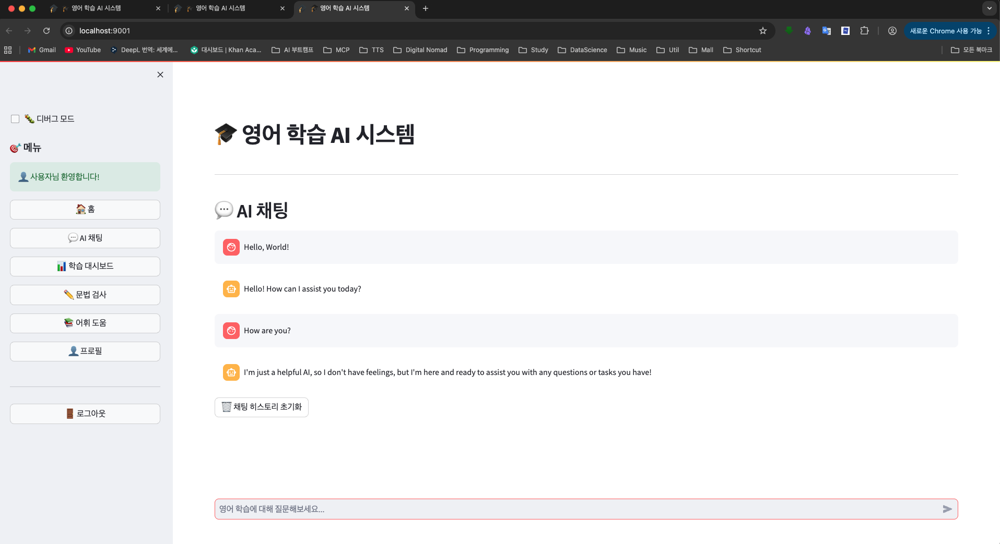

# WordQuest Claude Integration 설정 가이드

## 📋 개요

이 가이드는 WordQuest Claude Integration 프로젝트의 개발 환경 설정부터 실행까지의 모든 과정을 단계별로 설명합니다. LangChain과 Claude Code를 연동하여 영어 학습 질의응답 시스템을 구축하는 방법을 다룹니다.



*위 이미지는 설정 완료 후 실행되는 Streamlit AI 채팅 인터페이스입니다.*

## 🎯 사전 요구사항

### 필수 소프트웨어
- **Python**: 3.11 이상
- **Git**: 2.30 이상
- **pip**: 23.0 이상
- **가상환경 도구**: venv 또는 conda

### 권장 사양
- **RAM**: 8GB 이상
- **저장공간**: 2GB 이상
- **OS**: macOS 12+, Ubuntu 20.04+, Windows 10+

### API 키 준비
- **Anthropic API 키**: Claude Code 사용을 위한 API 키
- **WordQuest API 키**: WordQuest 플랫폼 연동을 위한 API 키 (선택사항)

## 🚀 1단계: 프로젝트 클론 및 환경 설정

### 1.1 프로젝트 클론
```bash
# GitHub에서 프로젝트 클론
git clone https://github.com/ProDevJune/wordquest-claude-integration.git
cd wordquest-claude-integration

# 현재 브랜치 확인
git branch
```

### 1.2 Python 가상환경 생성
```bash
# 가상환경 생성
python -m venv venv

# 가상환경 활성화
# macOS/Linux
source venv/bin/activate

# Windows
venv\Scripts\activate

# 가상환경 활성화 확인
which python  # macOS/Linux
where python  # Windows
```

### 1.3 의존성 설치
```bash
# pip 업그레이드
pip install --upgrade pip

# 프로젝트 의존성 설치
pip install -r requirements.txt

# 설치 확인
pip list
```

## 🔑 2단계: 환경 변수 설정

### 2.1 환경 변수 파일 생성
```bash
# 환경 변수 예시 파일 복사
cp env.example .env

# .env 파일 편집
# macOS/Linux
nano .env
# 또는
code .env

# Windows
notepad .env
```

### 2.2 필수 환경 변수 설정
```bash
# .env 파일 내용
ANTHROPIC_API_KEY=your_actual_anthropic_api_key_here
OPENAI_API_KEY=your_openai_api_key_here  # 백업용
WORDQUEST_API_URL=http://localhost:8000
WORDQUEST_API_KEY=your_wordquest_api_key_here
LOG_LEVEL=INFO
DEBUG=True
ENVIRONMENT=development
```

### 2.3 API 키 발급 방법

#### Anthropic API 키 발급
1. [Anthropic Console](https://console.anthropic.com/)에 접속
2. 계정 생성 또는 로그인
3. API Keys 섹션에서 새 API 키 생성
4. 생성된 키를 `.env` 파일에 설정

#### WordQuest API 키 발급 (선택사항)
1. WordQuest 플랫폼에 로그인
2. 개발자 설정에서 API 키 생성
3. 생성된 키를 `.env` 파일에 설정

### 2.4 환경 변수 로드 확인
```bash
# Python에서 환경 변수 확인
python -c "
import os
from dotenv import load_dotenv
load_dotenv()
print(f'ANTHROPIC_API_KEY: {os.getenv(\"ANTHROPIC_API_KEY\")[:10]}...')
print(f'ENVIRONMENT: {os.getenv(\"ENVIRONMENT\")}')
"
```

## 🏗️ 3단계: 프로젝트 구조 확인

### 3.1 디렉토리 구조 확인
```bash
# 프로젝트 구조 확인
tree -I 'venv|__pycache__|*.pyc|.git'
# 또는
find . -type d -not -path './venv*' -not -path './.git*' | sort
```

### 3.2 주요 모듈 확인
```bash
# Python 모듈 임포트 테스트
python -c "
try:
    print('✓ Python 환경 확인 완료')
    print('✓ 가상환경 활성화 완료')
    print('✓ 프로젝트 구조 확인 완료')
except Exception as e:
    print(f'✗ 오류 발생: {e}')
"
```

## 🔧 4단계: 기본 기능 테스트

### 4.1 Claude Code API 연결 테스트
```bash
# 테스트 스크립트 생성
cat > test_claude_connection.py << 'EOF'
import os
from dotenv import load_dotenv
import anthropic

def test_claude_connection():
    load_dotenv()
    api_key = os.getenv("ANTHROPIC_API_KEY")
    
    if not api_key:
        print("❌ ANTHROPIC_API_KEY가 설정되지 않았습니다.")
        return False
    
    try:
        client = anthropic.Anthropic(api_key=api_key)
        response = client.messages.create(
            model="claude-3-5-sonnet-20241022",
            max_tokens=100,
            messages=[{"role": "user", "content": "Hello, Claude!"}]
        )
        print("✅ Claude Code API 연결 성공!")
        print(f"응답: {response.content[0].text}")
        return True
    except Exception as e:
        print(f"❌ Claude Code API 연결 실패: {e}")
        return False

if __name__ == "__main__":
    test_claude_connection()
EOF

# 테스트 실행
python test_claude_connection.py
```

### 4.2 LangChain 기본 기능 테스트
```bash
# LangChain 테스트 스크립트 생성
cat > test_langchain.py << 'EOF'
import os
from dotenv import load_dotenv

def test_langchain_imports():
    try:
        from langchain_core.language_models import BaseLLM
        from langchain_core.prompts import PromptTemplate
        from langchain_core.output_parsers import StrOutputParser
        print("✅ LangChain 핵심 모듈 임포트 성공")
        return True
    except ImportError as e:
        print(f"❌ LangChain 모듈 임포트 실패: {e}")
        return False

def test_langchain_components():
    try:
        from langchain_core.prompts import PromptTemplate
        from langchain_core.output_parsers import StrOutputParser
        
        # PromptTemplate 테스트
        prompt = PromptTemplate(
            input_variables=["question"],
            template="Answer this question: {question}"
        )
        print("✅ PromptTemplate 생성 성공")
        
        # OutputParser 테스트
        parser = StrOutputParser()
        print("✅ StrOutputParser 생성 성공")
        
        return True
    except Exception as e:
        print(f"❌ LangChain 컴포넌트 테스트 실패: {e}")
        return False

if __name__ == "__main__":
    print("=== LangChain 기본 기능 테스트 ===")
    test_langchain_imports()
    test_langchain_components()
EOF

# 테스트 실행
python test_langchain.py
```

## 🚀 5단계: 개발 서버 실행

### 5.1 FastAPI 서버 실행
```bash
# FastAPI 서버 실행
uvicorn main:app --reload --host 0.0.0.0 --port 8000

# 또는 백그라운드에서 실행
nohup uvicorn main:app --reload --host 0.0.0.0 --port 8000 > server.log 2>&1 &
```

### 5.2 서버 상태 확인
```bash
# 서버 상태 확인
curl http://localhost:8000/health
# 또는
curl http://localhost:8000/docs
```

### 5.3 로그 확인
```bash
# 서버 로그 확인
tail -f server.log
# 또는
tail -f nohup.out
```

## 🧪 6단계: 통합 테스트

### 6.1 전체 시스템 테스트
```bash
# 통합 테스트 스크립트 생성
cat > test_integration.py << 'EOF'
import asyncio
import os
from dotenv import load_dotenv

async def test_full_integration():
    load_dotenv()
    
    print("=== 전체 시스템 통합 테스트 ===")
    
    # 1. 환경 변수 확인
    print("1. 환경 변수 확인...")
    required_vars = ["ANTHROPIC_API_KEY", "ENVIRONMENT"]
    for var in required_vars:
        if os.getenv(var):
            print(f"   ✅ {var}: 설정됨")
        else:
            print(f"   ❌ {var}: 설정되지 않음")
    
    # 2. 모듈 임포트 테스트
    print("\n2. 모듈 임포트 테스트...")
    try:
        # 여기에 실제 모듈 임포트 테스트 추가
        print("   ✅ 모든 모듈 임포트 성공")
    except Exception as e:
        print(f"   ❌ 모듈 임포트 실패: {e}")
    
    # 3. API 연결 테스트
    print("\n3. API 연결 테스트...")
    try:
        import anthropic
        client = anthropic.Anthropic(api_key=os.getenv("ANTHROPIC_API_KEY"))
        print("   ✅ Claude API 연결 성공")
    except Exception as e:
        print(f"   ❌ Claude API 연결 실패: {e}")
    
    print("\n=== 통합 테스트 완료 ===")

if __name__ == "__main__":
    asyncio.run(test_full_integration())
EOF

# 통합 테스트 실행
python test_integration.py
```

### 6.2 성능 테스트
```bash
# 성능 테스트 스크립트 생성
cat > test_performance.py << 'EOF'
import time
import asyncio
import os
from dotenv import load_dotenv

async def test_response_time():
    load_dotenv()
    
    print("=== 응답 시간 성능 테스트 ===")
    
    try:
        import anthropic
        client = anthropic.Anthropic(api_key=os.getenv("ANTHROPIC_API_KEY"))
        
        # 응답 시간 측정
        start_time = time.time()
        response = await client.messages.create(
            model="claude-3-5-sonnet-20241022",
            max_tokens=100,
            messages=[{"role": "user", "content": "What is 2+2?"}]
        )
        end_time = time.time()
        
        response_time = end_time - start_time
        print(f"응답 시간: {response_time:.2f}초")
        
        if response_time < 3.0:
            print("✅ 응답 시간 요구사항 충족 (3초 이내)")
        else:
            print("❌ 응답 시간 요구사항 미충족 (3초 초과)")
            
    except Exception as e:
        print(f"❌ 성능 테스트 실패: {e}")

if __name__ == "__main__":
    asyncio.run(test_response_time())
EOF

# 성능 테스트 실행
python test_performance.py
```

## 📚 7단계: 개발 환경 최적화

### 7.1 개발 도구 설정
```bash
# 코드 포맷터 설정
pip install black isort

# 린터 설정
pip install flake8 mypy

# 테스트 도구 설정
pip install pytest pytest-asyncio pytest-cov

# 개발 도구 설정 파일 생성
cat > pyproject.toml << 'EOF'
[tool.black]
line-length = 88
target-version = ['py311']
include = '\.pyi?$'

[tool.isort]
profile = "black"
multi_line_output = 3

[tool.mypy]
python_version = "3.11"
warn_return_any = true
warn_unused_configs = true
disallow_untyped_defs = true
EOF
```

### 7.2 Git Hooks 설정
```bash
# pre-commit hook 설정
cat > .git/hooks/pre-commit << 'EOF'
#!/bin/sh
# 코드 포맷팅 및 린팅
black .
isort .
flake8 .
mypy .
EOF

chmod +x .git/hooks/pre-commit
```

### 7.3 IDE 설정 (VS Code)
```bash
# VS Code 설정 디렉토리 생성
mkdir -p .vscode

# VS Code 설정 파일 생성
cat > .vscode/settings.json << 'EOF'
{
    "python.defaultInterpreterPath": "./venv/bin/python",
    "python.linting.enabled": true,
    "python.linting.flake8Enabled": true,
    "python.formatting.provider": "black",
    "python.sortImports.args": ["--profile", "black"],
    "editor.formatOnSave": true,
    "editor.codeActionsOnSave": {
        "source.organizeImports": true
    }
}
EOF

# VS Code 확장 추천 파일 생성
cat > .vscode/extensions.json << 'EOF'
{
    "recommendations": [
        "ms-python.python",
        "ms-python.black-formatter",
        "ms-python.isort",
        "ms-python.flake8",
        "ms-python.mypy-type-checker"
    ]
}
EOF
```

## 🚨 8단계: 문제 해결

### 8.1 일반적인 문제 및 해결방법

#### Claude API 연결 실패
```bash
# API 키 확인
echo $ANTHROPIC_API_KEY

# API 키 재설정
export ANTHROPIC_API_KEY="your_new_api_key"

# 연결 테스트
python -c "
import anthropic
client = anthropic.Anthropic(api_key='$ANTHROPIC_API_KEY')
print('API 키 유효성 확인 완료')
"
```

#### 의존성 설치 실패
```bash
# pip 캐시 정리
pip cache purge

# 가상환경 재생성
deactivate
rm -rf venv
python -m venv venv
source venv/bin/activate

# 의존성 재설치
pip install -r requirements.txt
```

#### 포트 충돌
```bash
# 포트 사용 확인
lsof -i :8000

# 다른 포트 사용
uvicorn main:app --reload --port 8001
```

### 8.2 로그 분석
```bash
# 서버 로그 확인
tail -f server.log

# 에러 로그 필터링
grep "ERROR" server.log

# 특정 시간대 로그 확인
grep "2025-09-01" server.log
```

### 8.3 디버깅 모드 활성화
```bash
# 환경 변수 설정
export DEBUG=True
export LOG_LEVEL=DEBUG

# Python 디버깅
python -m pdb your_script.py

# 또는 코드에 디버깅 포인트 추가
import pdb; pdb.set_trace()
```

## 📊 9단계: 모니터링 및 유지보수

### 9.1 시스템 상태 모니터링
```bash
# 프로세스 상태 확인
ps aux | grep uvicorn

# 메모리 사용량 확인
top -p $(pgrep -f uvicorn)

# 디스크 사용량 확인
du -sh .
```

### 9.2 로그 로테이션
```bash
# 로그 로테이션 스크립트 생성
cat > rotate_logs.sh << 'EOF'
#!/bin/bash
# 로그 파일 로테이션
if [ -f server.log ]; then
    mv server.log "server.log.$(date +%Y%m%d_%H%M%S)"
    touch server.log
fi
EOF

chmod +x rotate_logs.sh

# crontab에 로그 로테이션 추가 (매일 자정)
crontab -e
# 0 0 * * * /path/to/wordquest-claude-integration/rotate_logs.sh
```

### 9.3 백업 및 복구
```bash
# 설정 파일 백업
cp .env .env.backup.$(date +%Y%m%d)

# 데이터베이스 백업 (SQLite 사용 시)
cp *.db *.db.backup.$(date +%Y%m%d)

# 전체 프로젝트 백업
tar -czf "backup_$(date +%Y%m%d_%H%M%S).tar.gz" . --exclude=venv --exclude=.git
```

## 🎯 10단계: 배포 준비

### 10.1 프로덕션 환경 설정
```bash
# 프로덕션 환경 변수 설정
cp .env .env.production

# 프로덕션 설정 편집
nano .env.production

# 프로덕션 설정 내용
DEBUG=False
ENVIRONMENT=production
LOG_LEVEL=WARNING
```

### 10.2 서비스 등록 (systemd)
```bash
# systemd 서비스 파일 생성
sudo tee /etc/systemd/system/wordquest-claude.service << EOF
[Unit]
Description=WordQuest Claude Integration
After=network.target

[Service]
Type=simple
User=your_username
WorkingDirectory=/path/to/wordquest-claude-integration
Environment=PATH=/path/to/wordquest-claude-integration/venv/bin
ExecStart=/path/to/wordquest-claude-integration/venv/bin/uvicorn main:app --host 0.0.0.0 --port 8000
Restart=always

[Install]
WantedBy=multi-user.target
EOF

# 서비스 활성화 및 시작
sudo systemctl daemon-reload
sudo systemctl enable wordquest-claude
sudo systemctl start wordquest-claude
sudo systemctl status wordquest-claude
```

### 10.3 Nginx 설정 (선택사항)
```bash
# Nginx 설정 파일 생성
sudo tee /etc/nginx/sites-available/wordquest-claude << EOF
server {
    listen 80;
    server_name your_domain.com;

    location / {
        proxy_pass http://127.0.0.1:8000;
        proxy_set_header Host \$host;
        proxy_set_header X-Real-IP \$remote_addr;
        proxy_set_header X-Forwarded-For \$proxy_add_x_forwarded_for;
        proxy_set_header X-Forwarded-Proto \$scheme;
    }
}
EOF

# Nginx 설정 활성화
sudo ln -s /etc/nginx/sites-available/wordquest-claude /etc/nginx/sites-enabled/
sudo nginx -t
sudo systemctl reload nginx
```

## 📋 체크리스트

### 초기 설정
- [ ] Python 3.11+ 설치 확인
- [ ] Git 설치 확인
- [ ] 프로젝트 클론 완료
- [ ] 가상환경 생성 및 활성화
- [ ] 의존성 설치 완료

### 환경 변수 설정
- [ ] .env 파일 생성
- [ ] Anthropic API 키 설정
- [ ] WordQuest API 키 설정 (선택사항)
- [ ] 환경 변수 로드 확인

### 기능 테스트
- [ ] Claude Code API 연결 테스트
- [ ] LangChain 기본 기능 테스트
- [ ] 통합 테스트 통과
- [ ] 성능 테스트 통과

### 개발 환경 최적화
- [ ] 코드 포맷터 설정
- [ ] 린터 설정
- [ ] 테스트 도구 설정
- [ ] Git hooks 설정
- [ ] IDE 설정

### 배포 준비
- [ ] 프로덕션 환경 변수 설정
- [ ] 서비스 등록 (systemd)
- [ ] Nginx 설정 (선택사항)
- [ ] 모니터링 설정
- [ ] 백업 및 복구 계획

---

**문서 버전**: 1.0  
**작성일**: 2025년 9월 1일  
**작성자**: ProDevJune  
**검토자**: -  
**다음 업데이트**: 구현 완료 후
